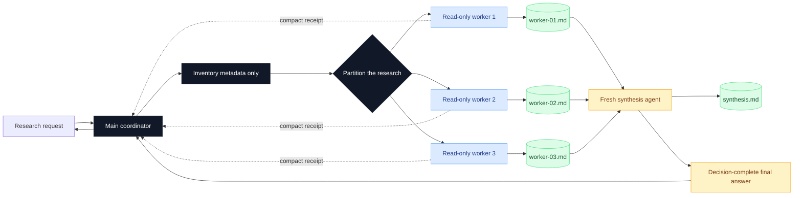
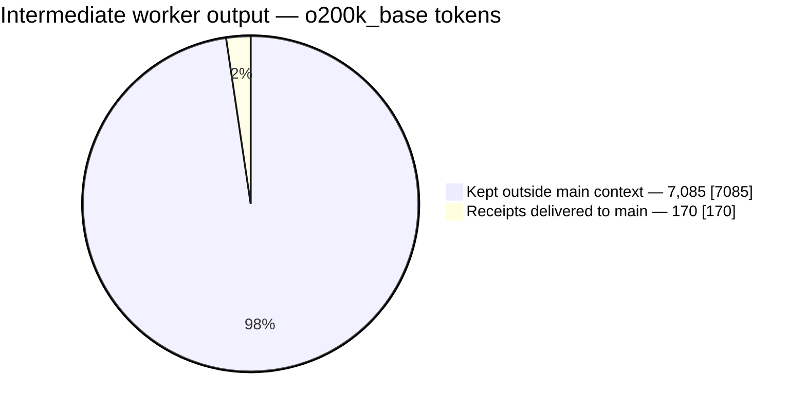

<div align="center">

# Research Swarm

### Parallelize information intake without flooding the main agent's context

[](./skills/research-swarm/SKILL.md)
[](./skills/research-swarm/SKILL.md)
[](./benchmarks/validated-run/metrics.json)
[](https://www.linkedin.com/in/mertcetin20/)

[How it works](#how-it-works) · [Measured impact](#measured-main-context-impact) · [Install](#installation) · [Use](#usage)

</div>

---

`research-swarm` is a reusable Codex and Claude Code skill for large research tasks. It divides independent reading across read-only subagents, stores complete worker findings outside the coordinator's conversation, and gives the main agent only compact integrity receipts plus one decision-ready synthesis.

The goal is deliberately narrow:

> **Make research faster through parallel intake while keeping raw sources and verbose intermediate analysis out of the main agent's context window.**

## Why this exists

A naive multi-agent research workflow still bloats the coordinator:

1. Every worker reads a different source.
2. Every worker pastes its full report back into the main conversation.
3. The main agent spends thousands of tokens carrying intermediate detail merely to synthesize it.

This skill changes the handoff boundary. Workers write complete reports to isolated files and return only small receipts containing the report path, coverage state, and finding/evidence counts. A fresh synthesis agent reads those reports and returns the final answer.

## How it works



### The context boundary

| Component | Reads raw sources? | Reads worker reports? | Returns to main context |
|---|---:|---:|---|
| Main coordinator | Metadata only | No | Research plan + final synthesis |
| Read-only workers | Yes, scoped lane only | No | Receipt under 700 characters |
| Synthesis agent | Only for targeted verification | Yes, all reports | Decision-complete synthesis |

The small JSON receipt is **not** a lossy summary. It is routing and integrity metadata:

```json
{
  "status": "done",
  "report_path": "/tmp/run/worker-01.md",
  "sources_reviewed": 4,
  "finding_count": 12,
  "evidence_count": 27,
  "coverage_complete": true,
  "report_bytes": 14820,
  "gaps": []
}
```

All material findings remain in the worker report. The synthesis contract requires every finding to be represented, deliberately merged, or explicitly excluded with a reason.

## Measured main-context impact

A validated run used two parallel workers to compare three large skill artifacts. The workers produced **31 findings** backed by **94 evidence pointers**.

Without report isolation, the two detailed worker reports would have added **7,255 tokens** to the main context. With compact receipts, the intermediate handoff added only **170 tokens**.



| Metric | Full worker reports | Compact receipts | Reduction |
|---|---:|---:|---:|
| Characters | 27,123 | 641 | **97.64%** |
| Estimated tokens (`o200k_base`) | 7,255 | 170 | **97.66%** |
| Tokens kept out of main context | — | — | **7,085** |

The full synthesis preserved the result as **10 merged findings with 0 deliberately excluded findings**.

> [!IMPORTANT]
> This is a measurement of **main-context pressure**, not total API usage or billing. Parallel workers may consume more aggregate compute. The required final synthesis is intentionally excluded because both the baseline and optimized design must deliver it.

Token counts use OpenAI's `o200k_base` tokenizer as a reproducible estimate. Different models tokenize text differently; the **97.64% character reduction** is tokenizer-independent.

Raw benchmark data: [`benchmarks/validated-run/metrics.json`](./benchmarks/validated-run/metrics.json)

Re-run the measurement on any compatible research run:

```bash
uv run --with tiktoken \
  python scripts/measure_context_savings.py /path/to/run-directory
```

The run directory must contain `worker-*.md` and `receipt-*.json` files.

## Features

- **Parallel read-only research** using source shards, analytical lenses, or a hybrid partition.
- **Context-isolated worker reports** stored outside the main conversation.
- **Lossless handoff contracts** with finding, evidence, coverage, and gap accounting.
- **Dedicated synthesis pass** that reads worker artifacts instead of making the main agent reopen them.
- **Evidence-first output** with paths, lines, URLs, commits, and explicit confidence.
- **Contradiction preservation** rather than majority-voting conflicting claims away.
- **Bounded concurrency**: normally 2–3 workers, increased only for clean independent lanes.
- **Graceful partial failure** with explicit coverage gaps.
- **One universal skill** that adapts its subagent dispatch to Codex or Claude Code.

## Repository layout

```text
research-swarm/
├── skills/
│   └── research-swarm/
│       ├── SKILL.md
│       ├── agents/openai.yaml
│       └── references/
├── benchmarks/
│   └── validated-run/metrics.json
├── scripts/
│   └── measure_context_savings.py
└── README.md
```

## Installation

### Skills CLI

Install from GitHub with automatic agent detection:

```bash
npx skills add merttcetn/research-swarm -g
```

Or select the target explicitly:

```bash
npx skills add merttcetn/research-swarm -g --agent codex
npx skills add merttcetn/research-swarm -g --agent claude-code
```

### Manual installation

Codex:

```bash
mkdir -p ~/.codex/skills/research-swarm
rsync -a skills/research-swarm/ ~/.codex/skills/research-swarm/
```

Invoke explicitly with:

```text
$research-swarm
```

Claude Code:

```bash
mkdir -p ~/.claude/skills/research-swarm
rsync -a skills/research-swarm/ ~/.claude/skills/research-swarm/
```

Invoke explicitly with:

```text
/research-swarm
```

The universal skill adapts to the active runtime. In Claude Code it coordinates from the main thread because Claude Code subagents cannot spawn nested subagents. Detailed worker activity remains isolated; only compact receipts return to the coordinator.

## Usage

### Analyze one large source through independent lenses

```text
$research-swarm

Analyze this transcript with separate subagents for:
1. recurring workflows,
2. technical feasibility and risks,
3. reusable skill candidates.

Return one evidence-backed synthesis without loading the full transcript
into the main context.
```

### Compare many reports

```text
/research-swarm

Split the reports in ./research across read-only workers. Identify consensus,
contradictions, unresolved questions, and the five most important decisions.
Preserve a full synthesis artifact.
```

### Inspect independent repository areas

```text
$research-swarm

Research authentication, data persistence, and API boundaries in parallel.
Do not edit files. Return a source-linked architecture assessment.
```

## When to use it

Use the skill when:

- the source set is too large for one context window;
- multiple independent analytical lenses improve the answer;
- research can be partitioned without cross-worker dependencies;
- evidence mapping and contradiction analysis matter;
- the user explicitly requests parallel subagents.

Work directly when one short source and one narrow question can be answered faster without delegation.

## Safety and limitations

- Sources and project files remain read-only throughout the research workflow.
- Workers may write only their assigned temporary report artifact.
- Shared filesystem access provides the strongest context isolation.
- Without shared artifact storage, perfect lossless handoff and perfect context isolation cannot both be guaranteed.
- The skill reduces main-agent context pressure; it does not promise lower total compute usage.
- Speedup depends on source independence, available concurrency, tool latency, and model limits.
- Model agreement is not treated as independent source corroboration.
- Research and implementation stay separate; this skill does not silently apply findings.

## Author

Created by **Mert Çetin**.

- [LinkedIn](https://www.linkedin.com/in/mertcetin20/)
- [GitHub repository](https://github.com/merttcetn/research-swarm)

---

<div align="center">

Built for faster research, smaller coordinator contexts, and evidence that survives the handoff.

</div>
